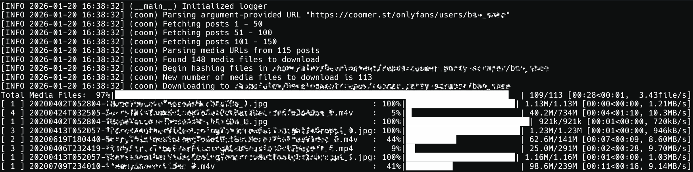

# Coomer and Kemono Scraper / Downloader

A scraper to download some or all media from Coomer and Kemono uploaded by a specified creator using a multithreading orchestrator in Python.




## How to Use

The easiest route is to download the latest release for your platform, run the executable, and follow the prompts.

If a release is not available for your platform, follow the instructions to install it as a Python module


## Install Python Module

If you don't want to (or are unable to) use a packaged release, you can install the tool as a Python module by running the the following command while in the directory containing the pyproject.toml file.

```sh
python3 -m pip install .
```

The scraper can then be run as a Python module or as a standalone command.

```sh
# Option 1: Run as a Python module
python3 -m coomerscraper

# Option 2: Run as a standalone command
coomerscraper
```


### Advanced Usage

```
usage: coomerscraper [-h] [-c] [--dump-urls] [-j JOBS] [--log-file LOG_FILE] [--log-level LOG_LEVEL]
                     [--offset-end END] [--offset-start START] [-o OUT] [--skip-imgs] [--skip-vids]
                     [urls ...]

Coomer and Kemono scraper

positional arguments:
  urls                  coomer or kemono URLs to scrape media from, separated by a space

options:
  -h, --help            show this help message and exit
  -c, --confirm         confirm arguments before proceeding
  --dump-urls           print the urls to a text file instead of downloading
  -j, --jobs JOBS       number of concurrent download threads (default: 4)
  --log-file LOG_FILE   direct logs to a file instead of stdout
  --log-level LOG_LEVEL level of logging (DEBUG, INFO, WARNING, ERROR; default: INFO)
  --offset-end END      ending offset to finish downloading
  --offset-start START  starting offset to begin downloading
  -o, --out OUT         download destination (default: CWD)
  --skip-imgs           skip image downloads
  --skip-vids           skip video downloads
```

The URL can be a page for a creator, a post from a creator, or a single media file. The starting and ending offsets are only respected when downloading from a page. When downloading a single media file, the creator name cannot be determined, thus goes in a subfolder named "unknown."

If the URL is omitted, then you will be prompted for all parameters during execution.


## Docker Container

Github actions is used to automatically build a new Docker image on every push to the main branch. You can use the Docker container with all the normal arguments. This could be an example configuration of a Docker compose file scraping multiple creators:

```
services:
  scraper:
    image: ghcr.io/a-coom/coomer.party-scraper:latest
    volumes:
      - "/PATH/ON/YOUR/HOST:/app"
    command: --log-level ERROR LINK LINK2
```

Alternatively, a Docker container can be run directly using a command like the following:

```
docker run -v /PATH/ON/YOUR/HOST:/app coomerscraper LINK1 LINK2
```


## Reporting an Issue

**Check the existing issues before opening a new one.** If the problem you are experiencing is not already reported, feel free to open a new issue with the following guidelines:

- **Do not include usernames anywhere in your issue**. Search engines may match these and result in DMCA problems.
- Provide a detailed description of the issue, including operating system, Python version, and any program arguments (redact all usernames).
- Create a log file using the arguments `--log-level DEBUG --log-file short_description.log`.
- Remove any usernames from the log file (URLs, file names, etc) before attaching it to your issue.

Please do not open an issue if you are having problems with `python3`, `pip`, or your `PATH` unless it is specifically related to the scraper.


## Requesting a Feature

**Check the existing and closed issues before opening a new one.** If the feature you would like included has not already been requested, feel free to open a new issue. Provide a detailed description of the feature and how you would expect it to behave.

Features that degrade the user experience are likely to be rejected.


## A Note on Scraping

This version is confirmed to work as of January 20, 2026. This approach uses the API when possible, which increases the reliability that it will continue to work in the future.


## Disclaimer

The website that this scraper targets is known to host media that is taken from many pay-per-view services without the consent of the original owner. By accessing this website (through a web browser or this tool), you are willfully viewing this stolen media. The user of the scraper is fully responsible for any consequences that may occur from these actions, and the developer(s) of this scraper does not assume responsibility for how the user chooses to act.


## Donate

If you use this tool, you clearly like free things. But if you enjoy this project and want to support its continued development, feel free to contribute and open pull requests for approval :)
