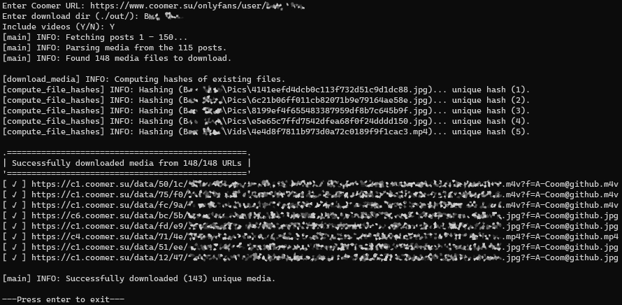

# Coomer and Kemono Scraper / Downloader

A scraper to download some or all media from coomer.su and kemono.su (previously coomer.party and kemono.party) uploaded by a specified artist using a multithreading orchestrator in Python.



## Usage

The easiest route is to download the latest release for your platform, run the executable, and follow the prompts.

If a release is not available for your platform, follow the platform agnostic approach

## Platform Agnostic Usage

The platform agnostic usage requires Python 3 to be installed on your system. If a release for your platform is available, use the executable file for easier usage.

### Submodule Dependency

Before using the platform agnostic command below, you must initialize the `scraping_utils` submodule. To do this, run the following command while in the repository directory: `git submodule update --init`

### Requirements

In its current state, this scraper requires the requests package. You can install this requirement by executing the following command in the repository directory:

`python3 -m pip install -r requirements.txt`

### Execution Command

```
usage: scrape.py [-h] [--out OUT] [--sub-folders] [--skip-vids] [--skip-imgs] [--confirm]
                 [--full-hash] [--offset-start START] [--offset-end END]
                 url

Coomer and Kemono scraper

positional arguments:
  url                   coomer or kemono URL or multiple URLs to scrape media from

optional arguments:
  -h, --help            show this help message and exit
  --out OUT, -o OUT     download destination (default: ./out)
  --sub-folders		create subfolders for creators when downloading full pages or posts
  --skip-vids           skip video downloads
  --skip-imgs           skip image downloads
  --confirm, -c         confirm arguments before proceeding
  --full-hash           calculate full hash of existing files. Ideal for a low
                        bandwidth use case, but requires more processing
  --offset-start START  starting offset to begin downloading
  --offset-end END      ending offset to finish downloading
```

The URL can be a page for an artist, a post from an artist, or a single media file. The starting and ending offsets are only respected when downloading from a page.

If the URL is omitted, then you will be prompted for all parameters during execution.

## Docker Container

For a docker container the Github actions is used to automatically build a new docker image on every push on main branch. You can use the docker container with all the arguments listed above. This could be an example configuration of a docker compose file scraping multiple creators and creating subfolders for every creator:

```
services:
  scraper:
    image: ghcr.io/a-coom/coomer.party-scraper:main
    volumes:
      - "/PATH/ON/YOUR/HOST:/out"
    command: --sub-folders --full-hash CREATORLINK CREATORLINK2
```

## A Note on Scraping

This version is confirmed to work as of December 3, 2024. This approach uses the API when possible, which increases the reliability that it will continue to work in the future. Nevertheless, if you encounter any problems, please open an issue.

## Disclaimer

The website that this scraper targets is known to host media that is taken from many pay-per-view services without the consent of the original owner. By accessing this website (through a web browser or this tool), you are willfully viewing this stolen media. The user of the scraper is fully responsible for any consequences that may occur from these actions, and the developer(s) of this scraper does not assume responsibility for how the user chooses to act.

## Donate

If you enjoy this project and want to support its continued development, you can buy me a coffee with Bitcoin :)

```
bc1q7fea7t5twypa4d2vg63qqw7a2tz9e3h2ke95wp
```


